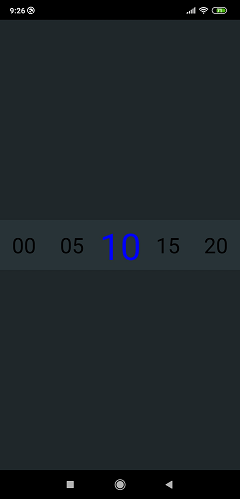

# Custom RecyclerView

Implementation of horizontal endless circular effect in RecyclerView: 
- Created custom doubly linked list
- Customized RecyclerView to get "endless circular effect" in both sides.

First solution "master" branch - is more preferable, reusing the same array there (3 times);

Second solution "second_branch" - is a hack (using Integer.MAX_VALUE in the adapter)

